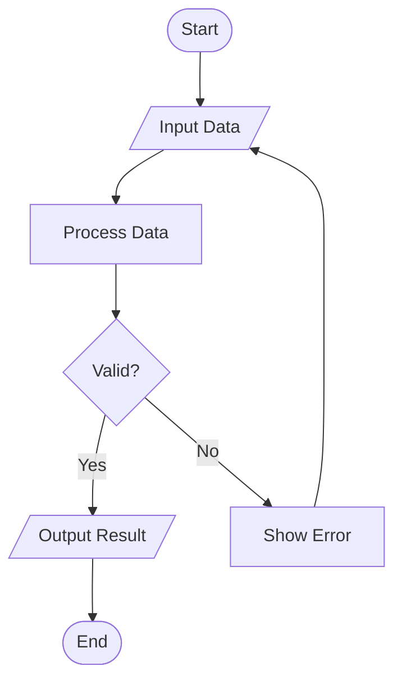
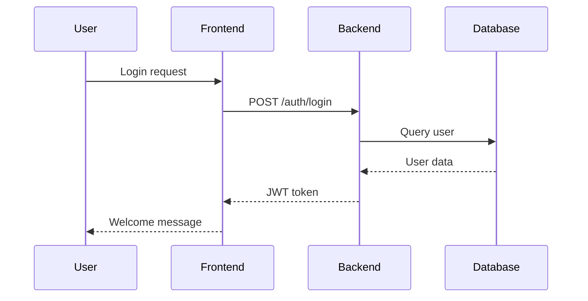
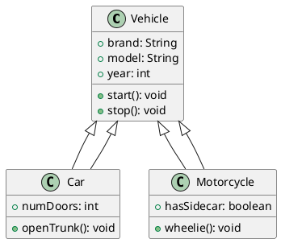
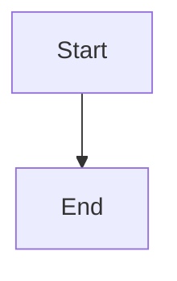
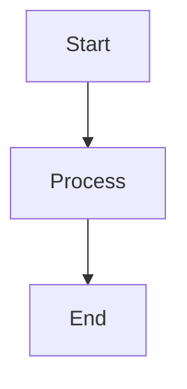
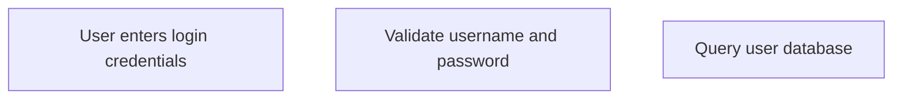
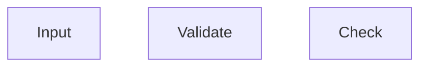

# Diagram Generator - User Guide

## Overview

The Diagram Generator is a powerful tool integrated into Mathanoshto AI that allows you to create, edit, and export beautiful diagrams using various diagram description languages.

## Features

### ✨ Key Features
- **Multiple Diagram Types**: Support for Mermaid, PlantUML, Graphviz, and more
- **Live Preview**: See your diagrams in real-time as you type
- **Rich Templates**: Pre-made templates for common diagram patterns
- **Export Options**: Export diagrams as SVG or PNG
- **Diagram Gallery**: Manage and view all your saved diagrams
- **Syntax Validation**: Built-in validation to catch errors before rendering

## Supported Diagram Types

### 1. Mermaid Diagrams
Mermaid is a JavaScript-based diagramming and charting tool that uses text definitions to create diagrams.

**Supported Types:**
- Flowcharts
- Sequence Diagrams
- Class Diagrams
- State Diagrams
- ER Diagrams
- Gantt Charts
- Pie Charts
- Journey Diagrams

### 2. PlantUML Diagrams
PlantUML is an open-source tool for creating UML diagrams from plain text descriptions.

**Supported Types:**
- Class Diagrams
- Sequence Diagrams
- Activity Diagrams
- Use Case Diagrams
- Component Diagrams
- Deployment Diagrams

### 3. Other Diagram Types
- **Graphviz**: Graph visualization
- **BlockDiag**: Simple block diagrams
- **BPMN**: Business Process Model diagrams
- **Excalidraw**: Hand-drawn style diagrams

## Getting Started

### Accessing the Diagram Generator

1. Log in to Mathanoshto AI
2. Click the **📊** icon in the sidebar
3. You'll be taken to the Diagram Generator interface

### Creating Your First Diagram

#### Using Templates (Recommended for Beginners)

1. Navigate to the **📚 Templates** tab
2. Browse available templates
3. Click **"Use Template"** on any template
4. Switch to the **✏️ Create Diagram** tab
5. The template code will be loaded in the editor
6. Modify the code to fit your needs
7. Click **"Generate"** to preview

#### Creating from Scratch

1. Go to the **✏️ Create Diagram** tab
2. Select your diagram type from the dropdown
3. Write your diagram code in the editor
4. Click **"Generate"** to preview
5. Use **"Validate"** to check for syntax errors
6. Click **"Export"** to save in multiple formats

## Interface Overview

### Create Diagram Tab

```
┌─────────────────────────────────────────────────┐
│  📋 Diagram Type  │ 📄 Format │ 🔄 Auto │ 🗑️  │
├─────────────────────┬───────────────────────────┤
│                     │                           │
│   ✏️ Editor        │    👁️ Preview           │
│                     │                           │
│   [Code Editor]     │   [Live Preview]          │
│                     │                           │
│   🎨 Generate       │   ⬇️ Download            │
│   ✓ Validate        │                           │
│   💾 Export         │                           │
└─────────────────────┴───────────────────────────┘
```

### Controls

- **📋 Diagram Type**: Select the type of diagram (Mermaid, PlantUML, etc.)
- **📄 Export Format**: Choose output format (SVG or PNG)
- **🔄 Auto**: Enable/disable auto-preview
- **🗑️ Clear**: Clear the editor
- **🎨 Generate**: Render the diagram
- **✓ Validate**: Check syntax without rendering
- **💾 Export**: Export in multiple formats

## Examples

### Example 1: Simple Flowchart (Mermaid)



### Example 2: Sequence Diagram (Mermaid)



### Example 3: Class Diagram (PlantUML)



## Advanced Usage

### Auto-Preview Mode

Enable **Auto-Preview** to see your diagram update in real-time as you type. This is great for quick iterations but may slow down performance for very large diagrams.

**When to use:**
- ✅ Small to medium diagrams
- ✅ Quick iterations
- ✅ Learning diagram syntax

**When to disable:**
- ❌ Very large diagrams
- ❌ Complex diagrams with many elements
- ❌ When typing long blocks of code

### Exporting Diagrams

#### Single Format Export

1. Generate your diagram
2. Click the **"⬇️ Download Diagram"** button
3. The file will download in your selected format

#### Multi-Format Export

1. Generate your diagram
2. Click the **"💾 Export"** button
3. A new section appears with format options
4. Click individual format buttons to download

#### Recommended Formats

**SVG (Scalable Vector Graphics)**
- ✅ Best for web embedding
- ✅ Scalable without quality loss
- ✅ Smaller file size
- ✅ Editable in vector editors
- ❌ Limited support in some applications

**PNG (Portable Network Graphics)**
- ✅ Universal compatibility
- ✅ Best for presentations/documents
- ✅ Easy to share
- ❌ Larger file size
- ❌ Loses quality when scaled

### Managing Saved Diagrams

Navigate to the **💾 My Diagrams** tab to:
- View all generated diagrams
- Preview diagrams in a gallery
- Download previously generated diagrams
- Delete unwanted diagrams

## Tips & Best Practices

### 1. Start Simple
Begin with basic diagrams and gradually add complexity. Use templates as starting points.

### 2. Use Comments
Add comments to your diagram code for better maintainability:

**Mermaid:**


**PlantUML:**


```plantuml
@startuml
' This is a comment
class User
@enduml
```

### 3. Organize Your Code
Use proper indentation and spacing for readability:

**Good:**


**Bad:**


### 4. Validate Before Generating
Always use the **Validate** button before generating complex diagrams to catch syntax errors early.

### 5. Keep Backups
Copy your diagram code to a text file for safekeeping, especially for complex diagrams you've spent time creating.

### 6. Use Descriptive Labels
Make your diagrams self-documenting with clear, descriptive labels:

**Good:**


**Bad:**


## Troubleshooting

### Diagram Not Rendering

**Issue**: Diagram fails to generate

**Solutions**:
1. Click **Validate** to check for syntax errors
2. Check that all tags are properly closed (PlantUML)
3. Verify diagram type is correctly selected
4. Check for typos in keywords
5. Review the error message for specific issues

### Preview Taking Too Long

**Issue**: Diagram generation is slow

**Solutions**:
1. Disable **Auto-Preview** for complex diagrams
2. Simplify your diagram
3. Try a different format (SVG is usually faster)
4. Check your internet connection (diagrams are rendered via Kroki service)

### Syntax Errors

**Common Issues**:

**Mermaid:**
- Missing diagram type declaration (flowchart, sequenceDiagram, etc.)
- Incorrect arrow syntax (use `-->` not `->`)
- Unclosed brackets or quotes

**PlantUML:**
- Missing `@startuml` or `@enduml` tags
- Incorrect relationship syntax
- Typos in keywords

### Export Issues

**Issue**: Cannot download diagram

**Solutions**:
1. Generate the diagram successfully first
2. Try both SVG and PNG formats
3. Check browser download permissions
4. Ensure stable internet connection

## Keyboard Shortcuts

| Shortcut | Action |
|----------|--------|
| `Ctrl + Enter` | Generate diagram |
| `Ctrl + S` | Save (browser default) |
| `Ctrl + A` | Select all text in editor |

## Resources

### Mermaid Resources
- [Mermaid Official Documentation](https://mermaid.js.org/)
- [Mermaid Live Editor](https://mermaid.live/)
- [Mermaid Syntax Reference](https://mermaid.js.org/intro/syntax-reference.html)

### PlantUML Resources
- [PlantUML Official Documentation](https://plantuml.com/)
- [PlantUML Online Server](http://www.plantuml.com/plantuml/)
- [PlantUML Cheat Sheet](https://plantuml.com/guide)

### Video Tutorials
- [Mermaid Crash Course](https://www.youtube.com/results?search_query=mermaid+diagram+tutorial)
- [PlantUML Tutorial](https://www.youtube.com/results?search_query=plantuml+tutorial)

## API Reference

### Kroki Service

The Diagram Generator uses [Kroki](https://kroki.io/), an open-source unified API for generating diagrams. Kroki supports 20+ diagram types and provides reliable, fast rendering.

**Benefits:**
- No local installation required
- Supports multiple diagram formats
- Fast rendering
- Free to use
- High availability

## Frequently Asked Questions

### Q: Is there a limit on diagram size?
**A:** There's no hard limit, but very large diagrams may take longer to render. We recommend keeping diagrams focused and breaking complex systems into multiple diagrams.

### Q: Can I use custom fonts or colors?
**A:** Yes! Both Mermaid and PlantUML support styling. Refer to their respective documentation for styling syntax.

### Q: Are my diagrams stored online?
**A:** Diagrams are generated using the Kroki service, but your files are stored locally on the server. Your diagram code is only sent to Kroki for rendering.

### Q: Can I collaborate on diagrams?
**A:** Currently, the Diagram Generator is single-user. For collaboration, share the exported diagram code or image files.

### Q: What if Kroki service is down?
**A:** If Kroki is unavailable, you can use alternative online editors like [Mermaid Live](https://mermaid.live/) or [PlantUML Online](http://www.plantuml.com/plantuml/).

### Q: Can I import existing diagrams?
**A:** Yes! Simply paste your diagram code into the editor and click Generate.

## Support

If you encounter issues or have questions:
1. Check this guide for common solutions
2. Review the syntax documentation for your diagram type
3. Use the Validate button to identify errors
4. Contact support with specific error messages

---

**Happy Diagramming! 📊✨**

