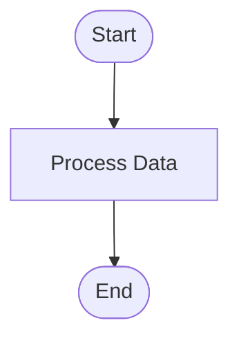

# Diagram Generator - Setup Guide

## Quick Start

The Diagram Generator has been successfully integrated into Mathanoshto AI. Follow these steps to start using it.

## Installation

### 1. Install Dependencies

Update your Python environment with the new dependencies:

```bash
pip install -r requirements.txt
```

**New Dependencies Added:**
- `streamlit-mermaid>=0.1.0` - Mermaid diagram support in Streamlit
- `mermaid>=0.1.0` - Mermaid diagram library
- `plantuml>=0.3.0` - PlantUML diagram support
- `kroki>=0.2.0` - Universal diagram service client
- `cairosvg>=2.7.0` - SVG to PNG conversion
- `svglib>=1.5.0` - SVG processing

### 2. Verify Installation

Run the application:

```bash
streamlit run frontend/streamlit/app.py
```

### 3. Access the Diagram Generator

1. Log in to the application
2. Click the **📊** icon in the sidebar
3. Start creating diagrams!

## Features Overview

### ✅ Implemented Features

- [x] **Mermaid diagram generation** (flowcharts, sequence diagrams)
- [x] **PlantUML support** (for UML diagrams)
- [x] **Diagram preview and export** (PNG, SVG)
- [x] **Diagram templates** (common patterns)
- [x] **Diagram editing interface**

### Additional Features

- [x] Live preview with auto-update
- [x] Syntax validation
- [x] Template library with 10+ pre-made templates
- [x] Diagram gallery for managing saved diagrams
- [x] Export in multiple formats (SVG, PNG)
- [x] Support for multiple diagram types (Mermaid, PlantUML, Graphviz, BlockDiag, BPMN)
- [x] Comprehensive help documentation
- [x] Beautiful UI matching existing design system

## Architecture

### Backend

**File**: `backend/tools/diagram_generator.py`

**Key Components:**
- `DiagramGenerator` class - Main diagram generation logic
- Kroki service integration - Remote diagram rendering
- Template library - Pre-defined diagram templates
- Validation system - Syntax checking
- Export functionality - Multi-format export

**Features:**
- Async diagram generation for better performance
- Caching system to avoid redundant API calls
- Support for 6 diagram types
- Template system with 11 pre-made templates
- Diagram metadata tracking

### Frontend

**File**: `frontend/streamlit/components/diagram_generator.py`

**Key Components:**
- `DiagramGeneratorUI` class - Main UI component
- Four-tab interface:
  - Create Diagram - Editor and preview
  - Templates - Template library
  - My Diagrams - Saved diagrams gallery
  - Help & Examples - Documentation

**Features:**
- Split-screen editor/preview layout
- Real-time preview with auto-update
- Template browser with one-click loading
- Diagram gallery with preview
- Export controls
- Syntax validation UI

### Integration

**Files Modified:**
- `frontend/streamlit/app.py` - Added diagram generator route
- `frontend/streamlit/components/sidebar.py` - Added navigation button
- `requirements.txt` - Added new dependencies

## Using the Diagram Generator

### Creating a Simple Flowchart

1. Open the Diagram Generator (📊 icon)
2. Go to "Create Diagram" tab
3. Select "mermaid" as diagram type
4. Enter this code:



5. Click "Generate"
6. Download as SVG or PNG

### Using Templates

1. Go to "Templates" tab
2. Browse available templates
3. Click "Use Template" on any template
4. Return to "Create Diagram" tab
5. Modify the loaded template
6. Generate and export

### Managing Saved Diagrams

1. Go to "My Diagrams" tab
2. View all generated diagrams
3. Download or delete diagrams
4. Preview diagrams before downloading

## Technical Details

### Diagram Rendering

The Diagram Generator uses **Kroki** (https://kroki.io/), a unified API for diagram generation. Kroki is:
- Free and open-source
- Supports 20+ diagram types
- Fast and reliable
- No installation required

### Caching

Generated diagrams are cached locally in `output/diagrams/` to:
- Speed up repeated renders
- Reduce API calls
- Save bandwidth
- Enable offline viewing of generated diagrams

### File Naming

Diagram files are named with the format:
```
{diagram_type}_{date}_{hash}.{format}
```

Example: `mermaid_20241112_a3f2b8c1d4e5.svg`

### Supported Formats

**Input Formats:**
- Mermaid syntax
- PlantUML syntax
- Graphviz DOT language
- BlockDiag syntax
- BPMN XML
- Excalidraw JSON

**Output Formats:**
- SVG (Scalable Vector Graphics)
- PNG (Portable Network Graphics)

## Directory Structure

```
tavily_search_wraper/
├── backend/
│   └── tools/
│       └── diagram_generator.py       # Backend logic
├── frontend/
│   └── streamlit/
│       └── components/
│           └── diagram_generator.py   # Frontend UI
├── output/
│   └── diagrams/                      # Generated diagrams
├── docs/
│   ├── DIAGRAM_GENERATOR_GUIDE.md     # User guide
│   └── DIAGRAM_GENERATOR_SETUP.md     # This file
└── requirements.txt                    # Updated with new deps
```

## Configuration

### Custom Output Directory

To change where diagrams are saved, modify the `output_dir` in `diagram_generator.py`:

```python
diagram_generator = DiagramGenerator(output_dir="custom/path")
```

### Kroki Service URL

To use a self-hosted Kroki instance:

```python
class DiagramGenerator:
    KROKI_URL = "https://your-kroki-instance.com"
```

## Troubleshooting

### Import Errors

**Issue**: `ModuleNotFoundError: No module named 'kroki'`

**Solution**:
```bash
pip install -r requirements.txt
```

### Connection Errors

**Issue**: Cannot connect to Kroki service

**Solutions**:
1. Check internet connection
2. Verify Kroki service is available: https://kroki.io/
3. Try again after a few moments

### Render Errors

**Issue**: Diagram fails to render

**Solutions**:
1. Validate syntax using the Validate button
2. Check diagram code for typos
3. Ensure diagram type matches the code syntax
4. Review error message for specific issues

### Performance Issues

**Issue**: Slow diagram generation

**Solutions**:
1. Disable auto-preview for large diagrams
2. Check internet speed
3. Simplify complex diagrams
4. Clear cached diagrams if storage is full

## API Usage

### Programmatic Usage

You can use the diagram generator programmatically:

```python
from backend.tools.diagram_generator import diagram_generator

# Generate a diagram
diagram_code = """
flowchart TD
    A[Start] --> B[End]
"""

success, file_path, error = diagram_generator.generate_diagram(
    diagram_code=diagram_code,
    diagram_type='mermaid',
    output_format='svg'
)

if success:
    print(f"Diagram saved to: {file_path}")
else:
    print(f"Error: {error}")
```

### Batch Generation

Generate multiple diagrams at once:

```python
from backend.tools.diagram_generator import diagram_generator

results = diagram_generator.export_diagram(
    diagram_code=diagram_code,
    diagram_type='mermaid',
    formats=['svg', 'png']
)

for format, path in results.items():
    print(f"{format.upper()}: {path}")
```

### Template Access

Access templates programmatically:

```python
from backend.tools.diagram_generator import diagram_generator

templates = diagram_generator.get_diagram_templates()

for template_id, template in templates.items():
    print(f"{template['name']}: {template['description']}")
```

## Performance Optimization

### Best Practices

1. **Enable caching** - Generated diagrams are automatically cached
2. **Use SVG for web** - Smaller file size, faster loading
3. **Disable auto-preview** - For complex diagrams
4. **Validate first** - Catch errors before rendering

### Monitoring

Monitor diagram generation:
- Check `output/diagrams/` for file sizes
- Clear old diagrams periodically
- Review error logs for failed generations

## Security Considerations

### Data Privacy

- Diagram code is sent to Kroki service for rendering
- No sensitive data is stored on Kroki servers
- Generated images are stored locally
- Use self-hosted Kroki for sensitive diagrams

### Best Practices

1. Don't include sensitive information in diagrams
2. Review diagram code before generating
3. Clear cache regularly for sensitive projects
4. Use self-hosted Kroki for maximum security

## Updates and Maintenance

### Updating Dependencies

```bash
pip install --upgrade streamlit-mermaid kroki cairosvg svglib
```

### Clearing Cache

Remove all cached diagrams:

```bash
rm -rf output/diagrams/*
```

Or use the UI to delete individual diagrams from the "My Diagrams" tab.

## Support and Documentation

- **User Guide**: `docs/DIAGRAM_GENERATOR_GUIDE.md`
- **Setup Guide**: This file
- **Mermaid Docs**: https://mermaid.js.org/
- **PlantUML Docs**: https://plantuml.com/
- **Kroki Docs**: https://kroki.io/

## Changelog

### Version 1.0.0 (2024-11-12)

**Added:**
- Complete diagram generator implementation
- Support for Mermaid diagrams
- Support for PlantUML diagrams
- Support for Graphviz, BlockDiag, BPMN, Excalidraw
- Template library with 11 templates
- Live preview with auto-update
- Export to SVG and PNG
- Diagram gallery
- Syntax validation
- Comprehensive documentation
- Beautiful UI matching existing design

## Future Enhancements

**Planned Features:**
- [ ] Diagram versioning
- [ ] Collaborative editing
- [ ] More diagram types (D2, Pikchr, etc.)
- [ ] Export to PDF
- [ ] Diagram sharing
- [ ] AI-powered diagram generation from text descriptions
- [ ] Custom themes and styling
- [ ] Diagram comparison
- [ ] Integration with chat for inline diagram generation

---

**Ready to create amazing diagrams! 📊✨**

